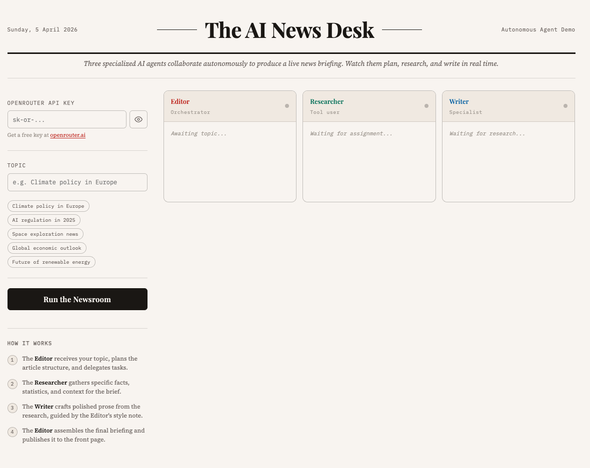

# The AI News Desk — Autonomous Agent Demo

A browser-based demo that shows non-technical audiences what autonomous AI agents are
and how they collaborate. Three specialized agents work together to produce a live news
briefing from any topic you provide.

## What it demonstrates

| Concept | How it's shown |
|---|---|
| Specialization | Each agent has a distinct role with its own system prompt |
| Tool use | The Researcher uses an LLM to gather specific, structured information |
| Agent-to-agent communication | Output from each agent is passed as structured input to the next |
| Orchestration | The Editor plans the task, delegates, and assembles the final output |
| Autonomous multi-step planning | The system runs from topic → published article without human steps |



## The three agents

1. **Editor** (Orchestrator) — receives the topic, writes a headline and research brief,
   delegates to the Researcher, then receives the article and publishes.
2. **Researcher** (Tool user) — takes the research brief and produces concrete findings:
   facts, figures, context, and angles.
3. **Writer** (Specialist) — takes the research findings and style note, produces
   a polished 3-paragraph news article.

## File structure

```
ai-news-desk/
├── index.html   — page structure and layout
├── style.css    — newspaper editorial design system
├── agents.js    — agent system prompts and OpenRouter API calls
├── app.js       — UI orchestration and demo flow
└── README.md    — this file
```

## Setup

This is a plain HTML/CSS/JS project. No build step, no npm, no dependencies.

1. Open `index.html` in any modern browser (Chrome, Firefox, Safari, Edge).
2. Get a free OpenRouter API key at https://openrouter.ai
3. Paste your API key into the key field.
4. Enter a topic (or pick one from the chips) and click **Run the Newsroom**.

The demo runs entirely in the browser. Your API key is never sent anywhere except
directly to the OpenRouter API.

## Model

Uses `minimax/minimax-m2.7` via the OpenRouter API endpoint:
`https://openrouter.ai/api/v1/chat/completions`

To switch models, change the `MODEL` constant at the top of `agents.js`.

## Customising the agents

All agent behaviour is controlled by the system prompts in `agents.js`:

- `EDITOR_PLAN_PROMPT` — how the Editor structures its plan
- `RESEARCHER_PROMPT` — how the Researcher formats its findings
- `WRITER_PROMPT` — the writing style and structure

Edit these to change how the agents behave, what format they output,
or how they communicate with each other.

## Running as a presentation demo

For presenting to a non-technical audience:
- Open `index.html` on a large display or screen share
- Pre-select an interesting topic before the session starts
- Walk through the agent cards as they fill up in real time
- Point out: each agent only knows its own role; they pass structured data, not chat messages

## License

MIT — free to use, modify, and share.
